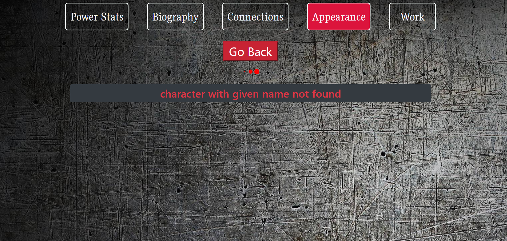

# A Superhero database application using Vue and Nuxt JS.

An application to retrieve information about your favorite superheroes from both marve
and DC universe using the API provided by <a> https://superheroapi.com </a> . Information like stats of the
superhero, groups affiliated to, villains, relatives and more can be retrieved from this
awesome API. It is free to use, but you need an authentication key to access the end-points
and fetch the data. You can get your API key from this website and then add it 
to your environment variables.

Aside from this, nothing much to talk about. This is an elementary application
which I built about an year ago to understand the basics of server side rendering in
Vue js using Nuxt. 

## Getting Started

* If you have worked with React and npm projects before, you'd know the procedure is fairly simply. Take the clone of the project, run 'npm install' and then
type in 'npm run dev'. The application by default would start on port 3000.

* For people not coming from node background, you need to install Node.js
runtime environment on your system and then install packages and using it to run the project following the steps described above. 

* Additionally, the API key is stored in a constant file and must be replaced
with your API key which you can get it from this link https://www.superheroapi.com

* Please find the screenshots of the application attached below.

## Built With

* [Vue JS](https://reactjs.org/)
* [Nuxt](https://material-ui.com/)
* [HTML + CSS + SCSS](https://www.w3schools.com/html/html_css.asp)

## Authors

* **Amit Prafulla (APFirebolt)** - (http://amitprafull.com/)

## License

This project is licensed under the MIT License - see the [LICENSE.md](LICENSE.md) file for details

## Screenshots

Please find some of the screenshots of the application. Below is the screenshot depicting search page when
no data is found, that means superhero name you entered does not exist 
in the database of the API provided.

Result not found page.

A screen shot showing query made for Batman for which multiple 
entries exist.

A screen shot showing how data would be displayed of a superhero,
in this example, data of Batman is depicted through component.

This screen shot features search page where you can type the name of the superhero
to search for.

